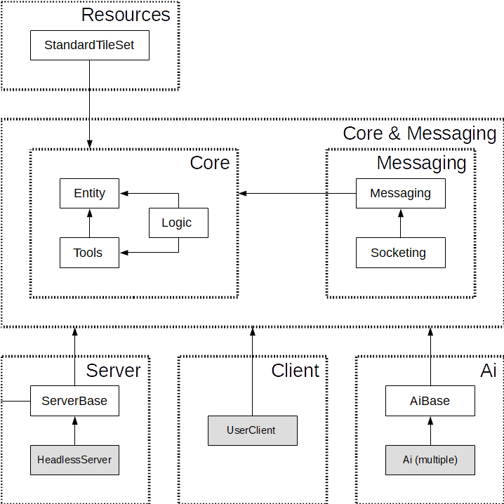

# Knihovny, spustitelné soubory a jejich závislosti

Jednotlivé knihovny a jejich popis:
- Core èást
  - [`CarcassonneDiscovery.Entity.dll`](Core-Entity.md) = tøídy, které reprezentují herní prvky (stav hry, kartièky, apod.)
  - [`CarcassonneDiscovery.Logic.dll`](Core-Logic.md) = tøídy, které se starají o herní logiku (kontrola pravidel, vykonání zmìny stavu hry)
  - [`CarcassonneDiscovery.Tools.dll`](Core-Tools.md) = pomocné tøídy a metody, které manipujují s herními prvky
- Messaging èást (komunikace mezi serverem a klienty)
  - [`CarcassonneDiscovery.Messaging.dll`](Messaging-Messaging.md) = tøídy, které slouží jako prostøedníci v komunikaci mezi serverem a klientem (jednotlivé "zprávy")
  - [`CarcassonneDiscovery.Socketing.dll`](Messaging-Socketing.md) = tøídy, které slouží jako sockety (koncové body komunikace)
- Server èást
  - [`CarcassonneDiscovery.ServerBase.dll`](Server-ServerBase.md) = tøídy, které jsou základem herního serveru (TODO: s interfacem pro vstup a výstup)
  - [`CarcassonneDiscovery.HeadlessServer.exe`](Server-HeadlessServer.md) = spusitelný server v headless módu
  - TODO: možná upravit interface tak, že se o komunikaci stará Headless remote
- Klient èást
  - [`CarcssonneDiscovery.UserClient.exe`](Client-UserClient.md) = spusitelný klient s GUI pro hru uživatele
  - TODO: mohlo by být opìt znou odlišitelné a znovupoužitelné i pro AI?!
- AI èást
  - [`CarcassonneDiscovery.AiBase.dll`](Ai-AiBase.md) = tøídy, které jsou základem AI klienta
  - jednotlivé implementace hráèù:
    - `CarcassonneDiscovery.TrivialAi.exe`
    - `CarcassonneDiscovery.SimpleHeuristicAi.exe`

Graf závislostí:

